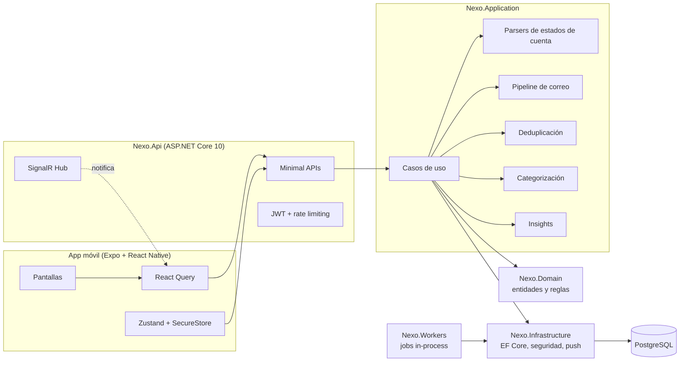
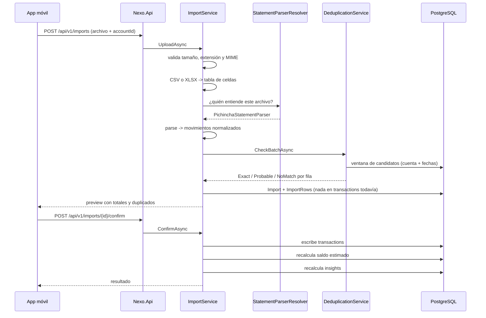

# Arquitectura

## Visión de conjunto

## Capas

| Proyecto | Responsabilidad | De qué depende |
| --- | --- | --- |
| `Nexo.Domain` | Entidades, invariantes, fingerprint, saldos. Sin dependencias externas. | Nada |
| `Nexo.Application` | Casos de uso, contratos de extensión (parsers), dedup, categorización, insights. | Domain, abstracciones de EF Core |
| `Nexo.Infrastructure` | EF Core + Npgsql, hashing, JWT, cifrado, seeds, push. | Application |
| `Nexo.Workers` | Jobs en background (insights, borrado diferido). | Infrastructure |
| `Nexo.Api` | Endpoints, autenticación, rate limiting, observabilidad, SignalR. | Infrastructure, Workers |

La regla es simple: **el dominio no sabe de bancos, ni de EF, ni de HTTP.**
Un parser nuevo no toca el dominio; una migración de EF no toca los casos de uso.

## Módulos de negocio

`Identity` · `Users` · `FinancialAccounts` · `Transactions` · `Imports` ·
`EmailIngestion` · `Providers` · `Categories` · `Insights` · `Notifications`

Cada uno vive en su carpeta dentro de `Application` (casos de uso) y `Domain`
(entidades). Son módulos, no microservicios: comparten proceso y base de datos.

## Flujo de una importación

Nada se escribe en `transactions` antes de que el usuario confirme el preview.

---

## Decisiones (ADR)

### ADR-001 — Modular monolith, no microservicios

**Contexto.** El MVP tiene un único consumidor (la app), un único almacén y un
equipo pequeño.
**Decisión.** Un solo despliegue con módulos separados por carpeta y por
proyecto, comunicándose por llamadas en proceso.
**Consecuencias.** Transacciones de base de datos simples, despliegue trivial y
depuración directa. Si un módulo (por ejemplo la ingesta de correo) necesita
escalar aparte, sus contratos ya están aislados y puede extraerse.

### ADR-002 — Superficie de dependencias mínima

**Contexto.** Cada paquete es superficie de ataque y una decisión de
mantenimiento en un producto que maneja datos financieros.
**Decisión.** Solo EF Core + Npgsql, JwtBearer y OpenAPI. El lector de CSV, el
lector de XLSX, el hasher de contraseñas (PBKDF2-HMAC-SHA512), el cifrado de
secretos (AES-GCM) y el logging estructurado se apoyan en la BCL.
**Consecuencias.** Unas 400 líneas propias que sí entendemos y sí podemos
testear, en vez de cuatro dependencias más. El lector de XLSX cubre lo que un
estado de cuenta necesita (celdas, cadenas compartidas, fechas); no pretende ser
una librería de Excel.

### ADR-003 — La capa de aplicación usa las abstracciones de EF Core

**Contexto.** Un repositorio por agregado añade indirección sin aportar aquí.
**Decisión.** `INexoDbContext` expone `DbSet<T>`; los casos de uso consultan con
LINQ. El proveedor concreto vive en Infrastructure.
**Consecuencias.** Menos código y consultas legibles. A cambio, la capa de
aplicación conoce `IQueryable`; el precio se paga en los tests, que corren
contra SQLite en memoria y no contra un doble.

### ADR-004 — Los workers corren dentro del host de la API

**Contexto.** El trabajo en background del MVP es recalcular insights y
completar borrados.
**Decisión.** `BackgroundService` en el mismo proceso, con `Nexo:Workers:Enabled`
para apagarlos.
**Consecuencias.** Cero infraestructura extra. Cuando la ingesta sea continua,
`Nexo.Workers` ya es un proyecto aparte y se convierte en su propio host.

### ADR-005 — Paginación por offset en el listado de movimientos

**Contexto.** La paginación por keyset necesita una columna de orden única y
comparable que todos los proveedores traduzcan.
**Decisión.** Offset + `totalCount`, con la lista siempre filtrada y páginas de
30.
**Consecuencias.** Simple y correcta hoy. Está anotada como deuda: cuando el
historial crezca, se añade una columna de secuencia y se cambia a keyset.

### ADR-006 — Aislamiento por usuario en dos capas

**Contexto.** Que un usuario vea el dinero de otro es el peor fallo posible de
este producto.
**Decisión.** (1) Todo `IUserOwned` recibe automáticamente un query filter por
usuario en el `DbContext`; (2) además, **todos** los casos de uso llevan su
`WHERE UserId = ...` explícito.
**Consecuencias.** Redundancia deliberada: olvidar una de las dos no rompe el
aislamiento. Los tests de autorización comprueban el comportamiento end-to-end.

### ADR-007 — El catálogo de proveedores es la única fuente de verdad

**Contexto.** Es tentador mostrar "conexión automática" antes de tenerla.
**Decisión.** `Provider.SupportedModes` describe lo que está implementado y
habilitado; la app dibuja solo eso, y abrir una cuenta en un modo no soportado
lanza una excepción de dominio.
**Consecuencias.** La UI no puede mentir por accidente. Activar un modo nuevo es
un cambio de datos, no de código.

### ADR-008 — La configuración sensible se resuelve tarde, nunca al componer

**Contexto.** `Program.cs` leía `Nexo:Jwt:SigningKey` de `builder.Configuration`
para armar el middleware bearer, y al mismo tiempo el servicio que **firma** los
tokens recibía `IOptions<JwtOptions>`, que se resuelve al usarse. Son dos vistas
distintas de la configuración: lo que se agrega después de los proveedores de la
aplicación —un host de pruebas, un proveedor tardío, un almacén de secretos—
llega a la segunda y no a la primera. El resultado fue una API que firmaba con
una clave y validaba con otra: el login devolvía 200 con un token impecable y
cada petición autenticada respondía 401, sin un solo error en los logs.

**Decisión.** Ningún valor de configuración se captura mientras se componen los
servicios. `JwtOptions` se enlaza una vez, el respaldo de desarrollo vive en un
`PostConfigure` que recibe `IHostEnvironment`, la exigencia de una clave real se
expresa con `Validate(...).ValidateOnStart()` —falla al arrancar, no al primer
login— y `JwtBearerOptions` se configura a partir de `IOptions<JwtOptions>`.
Después de `builder.Build()` se lee `app.Configuration`, que ya es la definitiva.

**Consecuencias.** Emisor y validador comparten origen por construcción, así que
la clase de fallo no puede reaparecer en silencio. `AuthenticationTests` fija la
propiedad como prueba: un token que esta API emite es un token que esta API
acepta. Efecto colateral: los sellos `nbf`/`exp` se toman de `TimeProvider` y no
de `IClock` —el reloj de negocio, que las pruebas fijan en el mes de sus
fixtures— porque el middleware los compara contra el reloj de pared.

### ADR-009 — Nunca componer `ids.Contains(...)` con el filtro global de usuario

**Contexto.** `DeduplicationService.CheckBatchAsync` filtraba movimientos con
`accountIds.Contains(t.FinancialAccountId)`. Combinado con el filtro global de
`NexoDbContext` (un `OrElse` sobre una propiedad del propio `DbContext`), EF Core no
podía traducir la consulta contra SQLite —el proveedor de las pruebas de
integración— y `POST /api/v1/imports` respondía 500 en cualquier importación, de
cualquier banco, con cualquier archivo. SQLite no tiene un tipo GUID nativo; el
proveedor de EF Core lo resuelve con su propio mapeo interno, y ese mapeo no
sobrevive la combinación de un `Contains` sobre un arreglo capturado con el árbol
booleano del filtro global. El mismo patrón exacto —`ids.Contains(entidad.Id)`
sobre un tipo `IUserOwned`— existía además en
`TransactionService.LoadAccountAliasesAsync` (rompía la pantalla de Movimientos en
cuanto existiera un solo movimiento) y en `PrivacyService` al eliminar una cuenta
financiera con historial de importaciones. Los tres se descubrieron buscando
variantes del mismo patrón, no solo el que reventó primero.

**Decisión.** Ningún filtro por lote de ids se escribe como `ids.Contains(...)`
sobre una columna Guid de un tipo `IUserOwned`. En su lugar,
`QueryableGuidExtensions.WhereIdIn` arma una cadena explícita de comparaciones de
igualdad (`OR`), que sí es traducible en todos los proveedores de Nexo porque es
exactamente la forma que ya usa cualquier búsqueda por un solo id. El filtro
explícito por `UserId` se mantiene siempre antes de `WhereIdIn` —la doble capa de
ADR-006 no se toca— y el filtro global de EF Core sigue activo (nunca se llama
`IgnoreQueryFilters` en esta ruta).

**Consecuencias.** Los conjuntos de ids en los que se usa este patrón son siempre
pequeños (una cuenta por importación, las cuentas distintas de una página de
movimientos, las filas de importación de una cuenta eliminada); no está pensado
para filtrar por miles de ids, y quien lo reutilice con un conjunto grande debe
medirlo antes. `DeduplicationFlowTests` cubre el caso que reventó primero (los
cuatro escenarios de importación de la auditoría, más el aislamiento cruzado
entre usuarios) e incluye, dentro de la misma prueba, la verificación de
`accountAlias` en el listado de movimientos que ejercitaba
`TransactionService.LoadAccountAliasesAsync`; `PrivacyFlowTests` cubre el tercer
sitio, en `PrivacyService.DeleteFinancialAccountAsync`.
`CrossSourceDeduplicationTests` complementa esto con el caso de deduplicación
entre canales (email + estado de cuenta) que motivó el Entregable 2.
