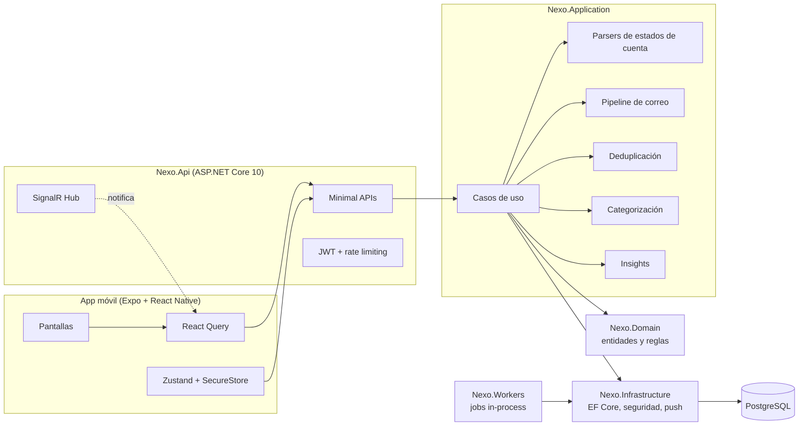
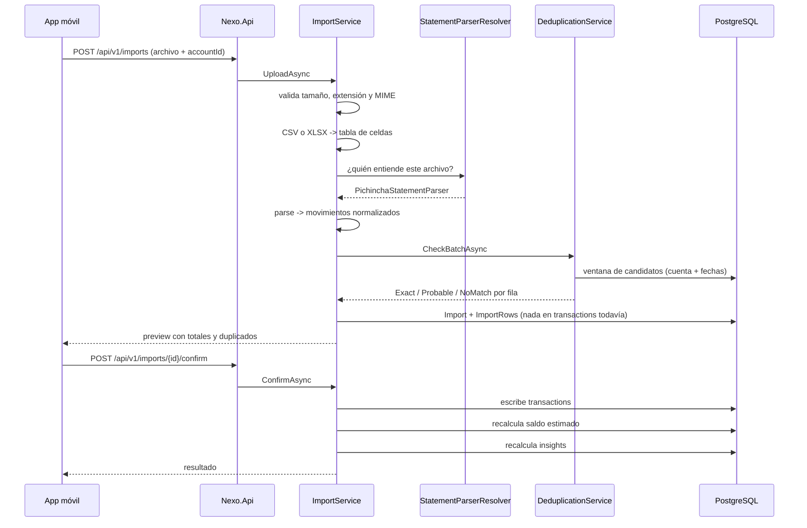

# Arquitectura

## Visión de conjunto

## Capas

| Proyecto | Responsabilidad | De qué depende |
| --- | --- | --- |
| `Nexo.Domain` | Entidades, invariantes, fingerprint, saldos. Sin dependencias externas. | Nada |
| `Nexo.Application` | Casos de uso, contratos de extensión (parsers), dedup, categorización, insights. | Domain, abstracciones de EF Core |
| `Nexo.Infrastructure` | EF Core + Npgsql, hashing, JWT, cifrado, seeds, push. | Application |
| `Nexo.Workers` | Jobs en background (insights, borrado diferido). | Infrastructure |
| `Nexo.Api` | Endpoints, autenticación, rate limiting, observabilidad, SignalR. | Infrastructure, Workers |

La regla es simple: **el dominio no sabe de bancos, ni de EF, ni de HTTP.**
Un parser nuevo no toca el dominio; una migración de EF no toca los casos de uso.

## Módulos de negocio

`Identity` · `Users` · `FinancialAccounts` · `Transactions` · `Imports` ·
`EmailIngestion` · `Providers` · `Categories` · `Insights` · `Notifications`

Cada uno vive en su carpeta dentro de `Application` (casos de uso) y `Domain`
(entidades). Son módulos, no microservicios: comparten proceso y base de datos.

## Flujo de una importación

Nada se escribe en `transactions` antes de que el usuario confirme el preview.

---

## Decisiones (ADR)

### ADR-001 — Modular monolith, no microservicios

**Contexto.** El MVP tiene un único consumidor (la app), un único almacén y un
equipo pequeño.
**Decisión.** Un solo despliegue con módulos separados por carpeta y por
proyecto, comunicándose por llamadas en proceso.
**Consecuencias.** Transacciones de base de datos simples, despliegue trivial y
depuración directa. Si un módulo (por ejemplo la ingesta de correo) necesita
escalar aparte, sus contratos ya están aislados y puede extraerse.

### ADR-002 — Superficie de dependencias mínima

**Contexto.** Cada paquete es superficie de ataque y una decisión de
mantenimiento en un producto que maneja datos financieros.
**Decisión.** Solo EF Core + Npgsql, JwtBearer y OpenAPI. El lector de CSV, el
lector de XLSX, el hasher de contraseñas (PBKDF2-HMAC-SHA512), el cifrado de
secretos (AES-GCM) y el logging estructurado se apoyan en la BCL.
**Consecuencias.** Unas 400 líneas propias que sí entendemos y sí podemos
testear, en vez de cuatro dependencias más. El lector de XLSX cubre lo que un
estado de cuenta necesita (celdas, cadenas compartidas, fechas); no pretende ser
una librería de Excel.

### ADR-003 — La capa de aplicación usa las abstracciones de EF Core

**Contexto.** Un repositorio por agregado añade indirección sin aportar aquí.
**Decisión.** `INexoDbContext` expone `DbSet<T>`; los casos de uso consultan con
LINQ. El proveedor concreto vive en Infrastructure.
**Consecuencias.** Menos código y consultas legibles. A cambio, la capa de
aplicación conoce `IQueryable`; el precio se paga en los tests, que corren
contra SQLite en memoria y no contra un doble.

### ADR-004 — Los workers corren dentro del host de la API

**Contexto.** El trabajo en background del MVP es recalcular insights y
completar borrados.
**Decisión.** `BackgroundService` en el mismo proceso, con `Nexo:Workers:Enabled`
para apagarlos.
**Consecuencias.** Cero infraestructura extra. Cuando la ingesta sea continua,
`Nexo.Workers` ya es un proyecto aparte y se convierte en su propio host.

### ADR-005 — Paginación por offset en el listado de movimientos

**Contexto.** La paginación por keyset necesita una columna de orden única y
comparable que todos los proveedores traduzcan.
**Decisión.** Offset + `totalCount`, con la lista siempre filtrada y páginas de
30.
**Consecuencias.** Simple y correcta hoy. Está anotada como deuda: cuando el
historial crezca, se añade una columna de secuencia y se cambia a keyset.

### ADR-006 — Aislamiento por usuario en dos capas

**Contexto.** Que un usuario vea el dinero de otro es el peor fallo posible de
este producto.
**Decisión.** (1) Todo `IUserOwned` recibe automáticamente un query filter por
usuario en el `DbContext`; (2) además, **todos** los casos de uso llevan su
`WHERE UserId = ...` explícito.
**Consecuencias.** Redundancia deliberada: olvidar una de las dos no rompe el
aislamiento. Los tests de autorización comprueban el comportamiento end-to-end.

### ADR-007 — El catálogo de proveedores es la única fuente de verdad

**Contexto.** Es tentador mostrar "conexión automática" antes de tenerla.
**Decisión.** `Provider.SupportedModes` describe lo que está implementado y
habilitado; la app dibuja solo eso, y abrir una cuenta en un modo no soportado
lanza una excepción de dominio.
**Consecuencias.** La UI no puede mentir por accidente. Activar un modo nuevo es
un cambio de datos, no de código.
