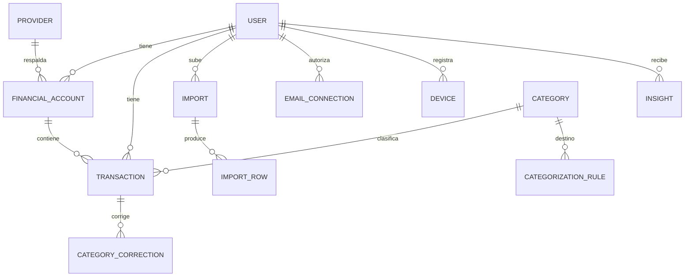
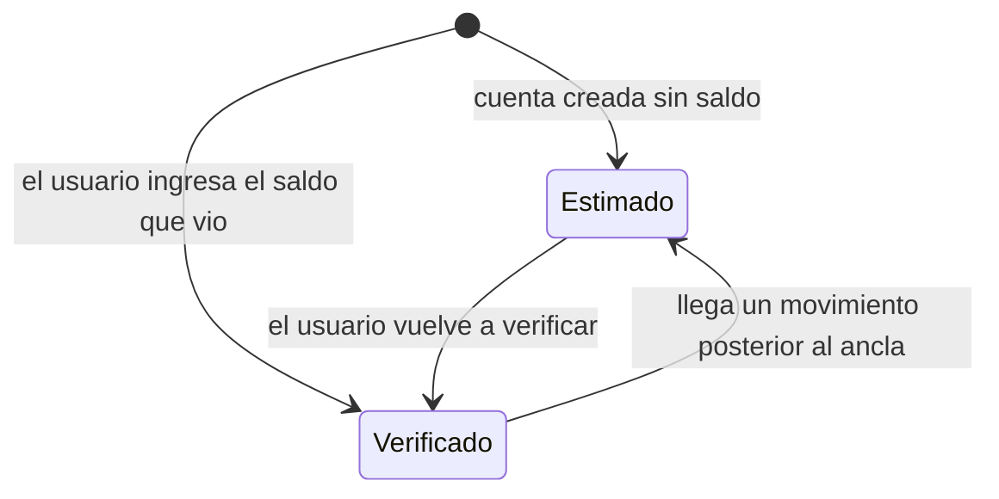

# Modelo de dominio

## Entidades



## Transaction — el modelo canónico

Venga de CSV, XLSX, correo, API o webhook, todo movimiento acaba en esta forma:

| Campo | Notas |
| --- | --- |
| `Id` | UUID v7: ordenable por creación, buenos índices |
| `UserId`, `FinancialAccountId` | Aislamiento y agrupación |
| `ProviderCode` | Código del catálogo, no un nombre libre |
| `ExternalReference` | Referencia del banco cuando existe |
| `TransactionDate` | Instante UTC, derivado de la fecha local del usuario |
| `Amount` | **Siempre positivo** |
| `Direction` | `Income` / `Expense` — aquí vive el signo |
| `Currency` | USD en el MVP; el esquema ya es multi-moneda |
| `Description`, `NormalizedDescription` | Original y clave de comparación |
| `Merchant` | Derivado de la descripción |
| `CategoryId`, `CategoryManuallySet` | Una corrección manual nunca la pisa una regla |
| `AccountMask` | Últimos 4 dígitos, nunca el número completo |
| `Source` | `Import` / `Email` / `Api` / `Webhook` / `Manual` |
| `SourceConfidence` | `Low` / `Medium` / `High` |
| `Status` | `Posted` / `Pending` / `NeedsReview` / `Ignored` |
| `Fingerprint` | Identidad determinista (ver deduplicación) |
| `PossibleDuplicateOfId` | Enlace al candidato cuando quedó para revisar |

**Por qué el monto es siempre positivo.** Cada banco tiene su convención de
signos; algunos usan columnas débito/crédito, otros un valor con signo, otros
invierten el signo en tarjetas de crédito. Normalizar a magnitud + dirección
elimina esa clase entera de errores de los reportes.

## Saldos: verificado vs. estimado

Nexo nunca presenta un número calculado como si fuera el saldo oficial del banco.



Se guardan cuatro campos: `LastVerifiedBalance`, `LastVerifiedAt`,
`EstimatedBalance`, `LastTransactionAt`.

* Un movimiento **anterior o igual** al ancla no se suma: ya está dentro del
  saldo verificado. Sumarlo lo contaría dos veces.
* `BalanceKind` es `Verified` solo mientras no haya movimientos posteriores al
  ancla.

Ejemplo del requerimiento:

```
Saldo verificado   $1,000.00
  +300.00
   -48.00
   -20.00
Saldo estimado     $1,232.00      <- así, con la palabra "estimado"
```

`RebuildEstimate` recalcula desde el ancla usando los movimientos almacenados, de
forma que el estimado nunca se desincroniza tras un borrado o una importación.

## Categorías

Doce categorías de sistema (`Comida`, `Supermercado`, `Transporte`, `Servicios`,
`Entretenimiento`, `Salud`, `Educación`, `Compras`, `Suscripciones`,
`Transferencias`, `Ingresos`, `Otros`) más las que cree el usuario.

La categorización es un motor de reglas: patrón + categoría + prioridad, todo
visible y editable. Cuando el usuario corrige una categoría:

1. se guarda un `CategoryCorrection` (dataset para mejorar reglas),
2. se crea o reapunta una regla del usuario con los primeros dos tokens
   normalizados de la descripción,
3. la transacción queda con `CategoryManuallySet = true` y ninguna regla la
   volverá a tocar.

## Insights

Reglas, no modelo. Cada insight es una cuenta que el usuario podría rehacer a
mano, que es justo lo que lo hace confiable en una app de dinero:

`MONTHLY_SPEND` · `MONTH_OVER_MONTH` · `TOP_CATEGORY` · `CATEGORY_CHANGE` ·
`RECURRING_SUBSCRIPTION` · `FREQUENT_MERCHANT` · `HIGHEST_SPEND_DAY` ·
`INCOME_VS_EXPENSE` · `STALE_ACCOUNT`

Una suscripción se detecta como: mismo comercio, importe dentro del ±15% de la
mediana, al menos 3 ocurrencias, separaciones de 25–35 días, y actividad en los
últimos 45 días.

Los insights son datos derivados: se borran y se recalculan enteros.
`IInsightEngine` es la costura por donde entrará un modelo más adelante.

## Zonas horarias

Una fecha de estado de cuenta es una fecha **local**, no un instante UTC.
`StatementDateInterpreter` convierte usando la zona del usuario
(`America/Guayaquil` por defecto). Sin eso, un movimiento del 1 de marzo a las
23:30 acaba contando en abril y rompe tanto los totales mensuales como la
deduplicación.
