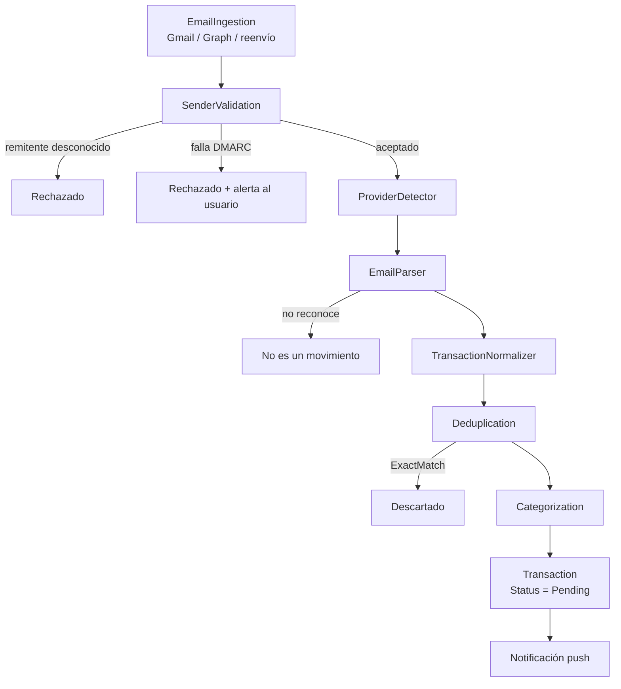

# Ingesta por correo

Muchos bancos ecuatorianos no ofrecen API pública, pero **todos** envían un
correo cuando ocurre un movimiento. Ese correo, con autorización explícita del
usuario, es la vía más realista para detección casi en tiempo real.

## Estado actual, sin adornos

| Pieza | Estado |
| --- | --- |
| Contratos (`IBankEmailParser`, `EmailMessage`, `ParsedTransaction`) | Implementado |
| Resolver por proveedor | Implementado |
| Validación de remitente (dominios + autenticación) | Implementado |
| Parsers para Pichincha, Guayaquil, Produbanco, Pacífico, DEUNA, PayPhone | Implementados sobre plantillas en español; **hay que validarlos contra correos reales** |
| Pipeline completo hasta `Transaction` | Implementado y testeado |
| Endpoint de entrada (`POST /api/v1/email-ingestion/inbound`) | Implementado, firmado con HMAC |
| Gmail OAuth | **Falta configuración**: no hay credenciales |
| Microsoft/Outlook OAuth | **Falta configuración**: no hay credenciales |
| Reenvío automático a un buzón Nexo | **Falta configuración**: dominio y secreto |

Sin credenciales, `POST /api/v1/email-connections` responde `409` y el endpoint
de entrada responde `503`. **No hay credenciales inventadas en el repositorio.**

## Pipeline



### 1. Validación del remitente — la etapa que de verdad importa

Falsificar `From: "Banco Pichincha"` es trivial. Por eso el nombre visible
**nunca** se consulta. Lo que decide es:

1. que el remitente del sobre esté en la lista blanca (`trusted_senders`), y
2. que el mensaje haya pasado SPF/DKIM/DMARC en el proveedor de correo.

Un mensaje que parece de un banco pero no está autenticado no se ignora en
silencio: se descarta **y** se avisa al usuario, porque eso es exactamente lo que
parece un intento de phishing.

Dominios sembrados: `pichincha.com`, `bancoguayaquil.com`, `produbanco.com`,
`pacifico.fin.ec`, `deuna.app`, `payphone.app`, `peigo.com.ec`. Se aceptan
subdominios (`mail.pichincha.com`), nunca imitaciones (`pichincha.com.algo`).

### 2. Parsers

```csharp
public interface IBankEmailParser
{
    string ProviderCode { get; }
    string ParserCode { get; }
    int Priority { get; }
    bool CanParse(EmailMessage message);
    Task<ParsedTransaction?> ParseAsync(EmailMessage message, CancellationToken cancellationToken);
}
```

`SpanishNotificationEmailParser` implementa lo común: palabras de ingreso y
gasto, exclusiones (estados de cuenta disponibles, cambios de clave,
promociones), y expresiones regulares compiladas para monto, comercio, máscara
de tarjeta, referencia, fecha y hora. Cada banco declara su firma y, si hace
falta, sobreescribe un patrón.

Los parsers evolucionan por separado: cambiar el de DEUNA no toca ningún otro.

### 3. Confianza

Un correo es un aviso, no una contabilización: el monto final puede cambiar
(propinas, retenciones). Por eso lo detectado por correo entra con
`SourceConfidence = Medium` y `Status = Pending`, y el estado de cuenta lo
confirma después (`UpgradeFrom`).

### 4. Minimización

Del mensaje se conserva solo lo necesario para describir el movimiento.
**El cuerpo del correo no se guarda.**

---

## Activar Gmail

1. Google Cloud Console → nuevo proyecto → habilitar **Gmail API**.
2. Pantalla de consentimiento OAuth: tipo externo, scope
   `https://www.googleapis.com/auth/gmail.readonly` (solo lectura).
3. Crear credenciales OAuth 2.0 y anotar client id / secret.
4. Configurar:

```bash
Nexo__EmailIngestion__Gmail__ClientId=...
Nexo__EmailIngestion__Gmail__ClientSecret=...
Nexo__EmailIngestion__Gmail__RedirectUri=https://api.nexo.app/oauth/gmail/callback
```

5. Implementar `GmailMailboxReader` (obtener tokens, guardarlos con
   `ISecretProtector`, listar mensajes con `historyId` y alimentar
   `IEmailIngestionPipeline`).

Google exige una verificación de la app para scopes restringidos: presupuestar
semanas, no días.

## Activar Outlook / Microsoft 365

Equivalente con Microsoft Entra ID y `Mail.Read`; el cursor incremental es el
`deltaLink` de Graph.

## Activar el reenvío

1. Dominio de entrada (`in.nexo.app`) en un proveedor con webhooks entrantes.
2. Configurar:

```bash
Nexo__EmailIngestion__Forwarding__InboundDomain=in.nexo.app
Nexo__EmailIngestion__Forwarding__WebhookSecret=<secreto compartido>
```

3. El relay hace `POST /api/v1/email-ingestion/inbound` con la cabecera
   `X-Nexo-Signature: HMAC-SHA256(webhookSecret, messageId)` en hexadecimal.
4. El relay debe reenviar el resultado de SPF/DKIM/DMARC en
   `passedAuthentication`. **Si el relay no lo evalúa, no se puede confiar en el
   correo** y esta vía no debe habilitarse.

## Antes de considerar los parsers listos para producción

Los patrones están escritos contra la redacción habitual de estas
notificaciones y contra las fixtures de `samples/`, todas ficticias. Antes de
activar la fase 2 hay que recolectar correos reales **con consentimiento
explícito**, verificar cada parser y añadir una fixture por banco.
