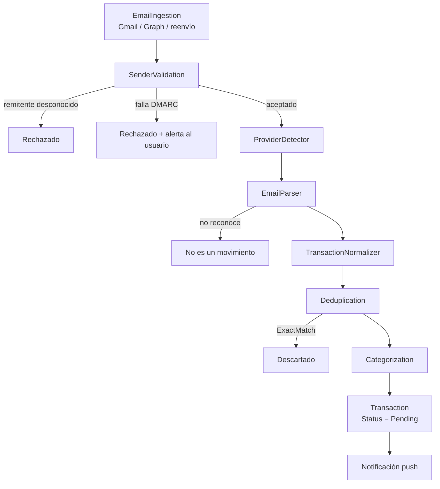

# Ingesta por correo

Muchos bancos ecuatorianos no ofrecen API pública, pero **todos** envían un
correo cuando ocurre un movimiento. Ese correo, con autorización explícita del
usuario, es la vía más realista para detección casi en tiempo real.

## Estado actual, sin adornos

| Pieza | Estado |
| --- | --- |
| Contratos (`IBankEmailParser`, `EmailMessage`, `ParsedTransaction`) | Implementado |
| Resolver por proveedor | Implementado |
| Validación de remitente (dominios + autenticación) | Implementado |
| Parsers para Pichincha, Guayaquil, Produbanco, Pacífico, DEUNA, PayPhone | Implementados sobre plantillas en español; **hay que validarlos contra correos reales** |
| Pipeline completo hasta `Transaction` | Implementado y testeado |
| Endpoint de entrada (`POST /api/v1/email-ingestion/inbound`) | Implementado, firmado con HMAC |
| Gmail OAuth | **Falta configuración**: no hay credenciales |
| Microsoft/Outlook OAuth | **Falta configuración**: no hay credenciales |
| Reenvío automático a un buzón Nexo | Implementado end-to-end una vez configurado dominio y secreto; no necesita OAuth |
| Pantalla móvil "Conectar correo" | Implementada (Entregable 23) |

Sin credenciales, `POST /api/v1/email-connections` responde `409` y el endpoint
de entrada responde `503`. **No hay credenciales inventadas en el repositorio.**

Gmail y Outlook necesitan un flujo de consentimiento real (Entregables 24/25):
mientras no exista, una conexión de ese tipo nunca puede pasar de
`PendingAuthorization`. Reenvío es distinto: no hay nada que consentir, así
que en cuanto `Nexo:EmailIngestion:Forwarding` tiene dominio y secreto,
`POST /api/v1/email-connections` con `providerKind = "Forwarding"` deja la
conexión en `Connected` de inmediato y devuelve la dirección de entrada
(`u-<id>@in.nexo.app`) para que la persona reenvíe ahí sus notificaciones.

## Pipeline



### 1. Validación del remitente — la etapa que de verdad importa

Falsificar `From: "Banco Pichincha"` es trivial. Por eso el nombre visible
**nunca** se consulta. Lo que decide es:

1. que el remitente del sobre esté en la lista blanca (`trusted_senders`), y
2. que el mensaje haya pasado SPF/DKIM/DMARC en el proveedor de correo.

Un mensaje que parece de un banco pero no está autenticado no se ignora en
silencio: se descarta **y** se avisa al usuario, porque eso es exactamente lo que
parece un intento de phishing.

Dominios sembrados: `pichincha.com`, `bancoguayaquil.com`, `produbanco.com`,
`pacifico.fin.ec`, `deuna.app`, `payphone.app`, `peigo.com.ec`. Se aceptan
subdominios (`mail.pichincha.com`), nunca imitaciones (`pichincha.com.algo`).

### 2. Parsers

```csharp
public interface IBankEmailParser
{
    string ProviderCode { get; }
    string ParserCode { get; }
    int Priority { get; }
    bool CanParse(EmailMessage message);
    Task<ParsedTransaction?> ParseAsync(EmailMessage message, CancellationToken cancellationToken);
}
```

`SpanishNotificationEmailParser` implementa lo común: palabras de ingreso y
gasto, exclusiones (estados de cuenta disponibles, cambios de clave,
promociones), y expresiones regulares compiladas para monto, comercio, máscara
de tarjeta, referencia, fecha y hora. Cada banco declara su firma y, si hace
falta, sobreescribe un patrón.

Los parsers evolucionan por separado: cambiar el de DEUNA no toca ningún otro.

### 3. Confianza

Un correo es un aviso, no una contabilización: el monto final puede cambiar
(propinas, retenciones). Por eso lo detectado por correo entra con
`SourceConfidence = Medium` y `Status = Pending`, y el estado de cuenta lo
confirma después (`UpgradeFrom`).

### 4. Minimización

Del mensaje se conserva solo lo necesario para describir el movimiento.
**El cuerpo del correo no se guarda.**

---

## Activar Gmail

1. Google Cloud Console → nuevo proyecto → habilitar **Gmail API**.
2. Pantalla de consentimiento OAuth: tipo externo, scope
   `https://www.googleapis.com/auth/gmail.readonly` (solo lectura).
3. Crear credenciales OAuth 2.0 y anotar client id / secret.
4. Configurar:

```bash
Nexo__EmailIngestion__Gmail__ClientId=...
Nexo__EmailIngestion__Gmail__ClientSecret=...
Nexo__EmailIngestion__Gmail__RedirectUri=https://api.nexo.app/oauth/gmail/callback
```

5. Implementar `GmailMailboxReader` (obtener tokens, guardarlos con
   `ISecretProtector`, listar mensajes con `historyId` y alimentar
   `IEmailIngestionPipeline`).

Google exige una verificación de la app para scopes restringidos: presupuestar
semanas, no días.

## Activar Outlook / Microsoft 365

Equivalente con Microsoft Entra ID y `Mail.Read`; el cursor incremental es el
`deltaLink` de Graph.

## Activar el reenvío

1. Dominio de entrada (`in.nexo.app`) en un proveedor con webhooks entrantes.
2. Configurar:

```bash
Nexo__EmailIngestion__Forwarding__InboundDomain=in.nexo.app
Nexo__EmailIngestion__Forwarding__WebhookSecret=<secreto compartido>
```

3. El relay hace `POST /api/v1/email-ingestion/inbound` con la cabecera
   `X-Nexo-Signature: HMAC-SHA256(webhookSecret, cuerpo completo de la petición)`
   en hexadecimal, en minúsculas. Firmar solo el `messageId` (como decía una
   versión anterior de este documento) permitiría reproducir una firma válida
   ya vista y reenviar el mismo mensaje con un `userId` distinto: la firma
   tiene que cubrir la petición entera, `userId` incluido.
4. El relay debe reenviar el resultado de SPF/DKIM/DMARC en
   `passedAuthentication`. **Si el relay no lo evalúa, no se puede confiar en el
   correo** y esta vía no debe habilitarse.

## Antes de considerar los parsers listos para producción

Los patrones están escritos contra la redacción habitual de estas
notificaciones y contra las fixtures de `samples/`, todas ficticias. Antes de
activar la fase 2 hay que recolectar correos reales **con consentimiento
explícito**, verificar cada parser y añadir una fixture por banco.

### Entregable 26 — correcciones aplicadas

Una revisión línea por línea de `SpanishNotificationEmailParser` y de
`EmailContracts.cs` encontró varios defectos concretos, ya corregidos y
cubiertos con test:

1. **HTML sin decodificar podía envenenar el comercio capturado.**
   `EmailMessage.SearchableText` ahora decodifica entidades HTML
   (`System.Net.WebUtility.HtmlDecode`) antes de que corra cualquier patrón.
   Sin esto, `SUPERMAXI&nbsp;ALBORADA` se convertía en el comercio
   "Supermaxi Nbsp" en vez de "Supermaxi Alborada".
2. **Las palabras de exclusión no se normalizaban.** `CanParse` compara
   ahora `ExcludeKeywords` contra el texto ya pasado por
   `TextNormalizer.Normalize`, igual que las palabras de ingreso/gasto, así
   que un acento o mayúscula distinta ya no hace que una exclusión falle en
   silencio.
3. **Recordatorios de pago se colaban como movimientos.** Se añadieron las
   exclusiones `FECHA DE PAGO`, `FECHA LIMITE DE PAGO`, `PAGO MINIMO`,
   `MONTO A PAGAR`, `RECORDATORIO DE PAGO`, `PROXIMO A VENCER` y
   `PENDIENTE DE PAGO`: un aviso de "tu pago mínimo vence el..." no es un
   movimiento aunque contenga un monto y la palabra "pago".
4. **El monto capturado podía ser un saldo, no la compra.** `TryReadAmount`
   ahora descarta una coincidencia si en los 40 caracteres anteriores
   aparece una palabra de saldo (`SALDO`, `CUPO`, `DISPONIBLE`, `LIMITE`) y
   sigue buscando la siguiente cifra. Antes, un correo que mencionaba
   "saldo disponible: $1,204.33" antes del monto real de la compra
   ($48.20) podía registrar el saldo como si fuera el gasto.
5. **Horas en formato de 12 horas se leían mal.** `TimeRegex` y `ReadDate`
   ahora reconocen `AM`/`PM` (con o sin puntos, con o sin espacio) y
   ajustan la hora en consecuencia; antes "6:12 PM" se interpretaba como
   las 6:12 de la mañana.
6. **La fecha se truncaba en formatos de un solo dígito.** `DateRegex`
   capturaba una fecha corta cuando el mes o el día tenían un solo dígito
   dentro de un texto más largo (p. ej. `2026-8-31` dentro de
   "...el 2026-8-31, 12:51 PM..."). El patrón corregido usa límites de
   palabra (`\b`) y captura el separador `/` o `-` de forma consistente.
   `DateParser.Formats` (usado por `TryParseDate`) ganó el formato
   `"yyyy-M-d"` para que una fecha suelta en esa forma no dependa del
   `DateTime.TryParse` flexible, que es sensible a la cultura del sistema.

### Entregable 26 — pendientes, no corregidos a propósito

- **`peigo.com.ec` no tiene parser.** El dominio está en la lista blanca de
  remitentes confiables (`ReferenceDataSeeder`) pero no existe un
  `IBankEmailParser` para PeiGo: no hay redacción real de sus notificaciones
  para basar un patrón, y escribir uno sin esa información sería inventar
  un formato y presentarlo como soportado. Un correo real de PeiGo hoy
  pasaría la validación de remitente pero terminaría en `NotAMovement`.
- **No hay techo de monto razonable.** `TryReadAmount` no rechaza una
  cifra absurdamente alta (p. ej. $500,000 en una notificación de consumo).
  Fijar un límite es una decisión de negocio (¿cuál es el monto máximo
  plausible de una transacción personal en Ecuador?) que no me corresponde
  tomar unilateralmente; queda para que Anderson la defina.
- **DEUNA/PayPhone: el ancla "a" para el comercio en transferencias
  persona-a-persona no cambió.** Es un patrón de alto riesgo de falsos
  positivos (la palabra "a" es extremadamente común en español) y no hay
  forma de probarlo por compilación en este entorno; se dejó como estaba
  en vez de arriesgar una regresión sin poder verificarla.
- **`AmountRegex` no maneja signo explícito.** Es una nota de diseño menor,
  de baja prioridad: el signo (+/-) de un monto en el texto del correo no
  se usa para determinar la dirección de la transacción (eso lo decide el
  parser por palabras clave de ingreso/gasto), así que hoy no causa un bug
  observable, pero merece revisión si algún banco empieza a mandar montos
  con signo explícito en su notificación.
