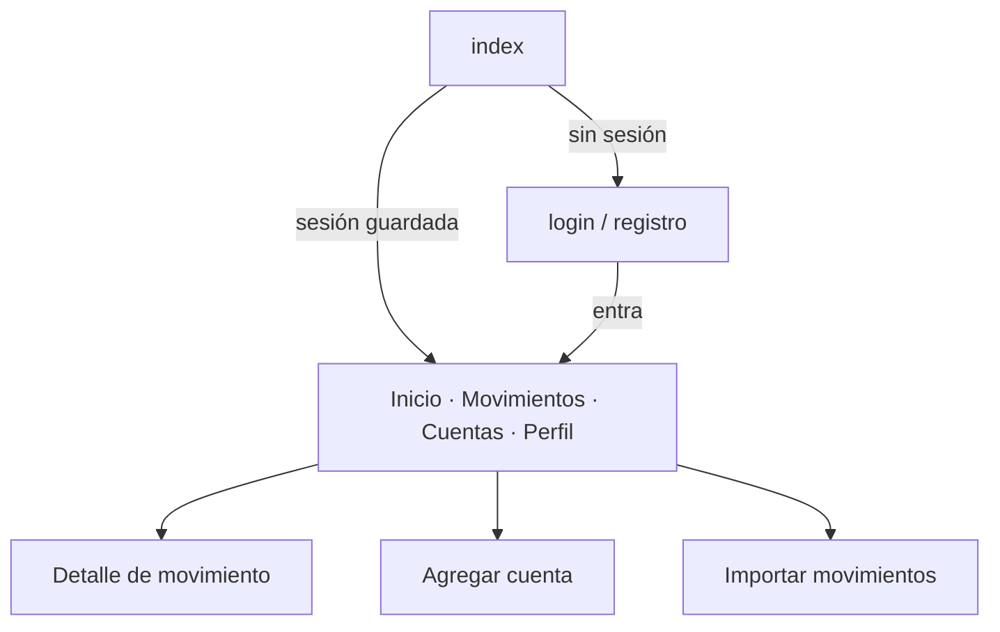

# Arquitectura del móvil

## Stack

React Native 0.86 · Expo SDK 57 · Expo Router · TypeScript estricto ·
React Query (servidor) · Zustand (sesión y preferencias) · SecureStore (tokens).

## Estructura

```
mobile/
├── app/                      # rutas (Expo Router)
│   ├── _layout.tsx           # providers + stack raíz
│   ├── index.tsx             # decide dónde entrar tras leer la sesión
│   ├── (auth)/               # login, registro
│   ├── (tabs)/               # Inicio, Movimientos, Cuentas, Perfil
│   ├── movimiento/[id].tsx   # detalle
│   └── cuentas/              # agregar, importar
├── components/
│   ├── ui/                   # primitivas del design system
│   ├── home/ transactions/ accounts/
├── hooks/                    # queries de React Query, push
├── services/                 # cliente HTTP, endpoints, SecureStore, config
├── store/                    # zustand
├── theme/                    # tokens
├── types/                    # espejo de los DTOs del backend
└── utils/                    # formato y agrupación (con tests)
```

**La lógica de negocio no vive en los componentes.** Formato, agrupación por día
y totales están en `utils/format.ts` (funciones puras con tests); el estado del
servidor lo maneja React Query; la sesión, Zustand.

## Design system

Identidad deliberadamente lejos del azul fintech: papel cálido, tinta casi negra
y un único acento lima usado con moderación.

| Token | Valor | Uso |
| --- | --- | --- |
| `background` | `#F5F3ED` | Fondo de toda la app |
| `surface` | `#FFFFFF` | Tarjetas |
| `surfaceSecondary` | `#ECE9E1` | Superficies secundarias, chips |
| `primary` | `#1D1D1B` | Texto principal, botones |
| `accent` | `#C7F36B` | Acento (poco y bien) |
| `accentSecondary` | `#8DD9B6` | Acento suave |
| `text` / `textSecondary` | `#191A18` / `#74766F` | Jerarquía tipográfica |
| `success` / `warning` / `danger` | `#4E9F73` / `#E4A853` / `#D8665B` | Estados |

Escala tipográfica de 8 pasos (`display` 44 → `overline` 11), espaciado de 4
puntos, radios de 10 a 28 y un solo estilo de sombra apenas perceptible: la
profundidad viene del espacio en blanco y del contraste, no de las sombras.

Todo el texto pasa por `<Typo variant="…">`, así que ninguna pantalla repite
tamaños de fuente y la jerarquía no depende del color.

Los importes usan cifras tabulares (`fontVariant: ['tabular-nums']`) para que las
columnas no bailen al cambiar de valor.

## Navegación



Cuatro pestañas, sin anidamientos extra. Los grupos `(auth)` y `(tabs)` tienen
guardas: `(tabs)` redirige a login si no hay sesión y viceversa.

## Sesión y tokens

* Access y refresh viven en `expo-secure-store` (Keychain / Keystore).
* `apiClient` recibe el token de la store mediante un callback, así que no hay
  ciclo de imports.
* Ante un `401` en una llamada autenticada, el cliente rota el refresh **una
  vez** y reintenta; si falla, limpia la sesión. Las pantallas no ven nada.
* Timeout de 20 s; un fallo de red se convierte en un mensaje legible en español,
  no en un stack trace.

## Estado del servidor

React Query con `staleTime` de 30 s y un reintento. Las invalidaciones son
explícitas donde importa: confirmar una importación invalida resumen, cuentas,
movimientos e insights; recategorizar invalida el detalle, la lista y el resumen.

La lista de movimientos usa `useInfiniteQuery` con páginas de 30 y scroll
infinito.

## Tiempo real

Dos capas, y la segunda es el suelo:

1. **SignalR** (`useRealtime`) para "acaba de entrar un movimiento" sin que el
   usuario haga nada. El hub no transporta datos financieros: dice *que* algo
   cambió y el cliente vuelve a pedirlo por la API autenticada, de modo que el
   socket nunca se convierte en una segunda vía —más débil— de leer el dinero
   de alguien.
2. **Refetch al volver a primer plano** (`AppState`). Si el socket nunca conecta
   —red restrictiva, un proxy que corta websockets, una sorpresa de bundling en
   un dispositivo real— la app se sigue actualizando, solo que menos inmediata.

El fallo de conexión es silencioso a propósito. El tiempo real es una mejora,
nunca algo de lo que el producto dependa.

## Pantallas

* **Inicio**: saludo, saldo total con opción de ocultar, ingresos y gastos del
  mes, insights en carrusel, cuentas, distribución por categoría y movimientos
  recientes. Una sola llamada (`GET /api/v1/summary`).
* **Movimientos**: búsqueda, filtros por dirección/cuenta/categoría, agrupación
  por día con total diario, scroll infinito.
* **Cuentas**: saldo por cuenta con su tipo (verificado o estimado), última
  actualización y acceso directo a importar.
* **Perfil**: ocultar cantidades, conexiones de correo, privacidad (exportar,
  eliminar) y cierre de sesión.
* **Detalle**: monto, comercio, fecha y hora, cuenta, categoría (editable),
  referencia, origen ("Importado desde estado de cuenta" / "Detectado desde
  notificación bancaria"), estado y nota.
* **Importar**: archivo → validación → preview → confirmación → resultado.

## Accesibilidad

Roles y estados en botones y chips, etiquetas descriptivas en las filas de
movimientos (`"Supermaxi, -$48.20"`), objetivos táctiles de 44 pt o más y
contraste suficiente para AA en el texto sobre papel.

## Tests

**Lógica** (19): formato de moneda, encabezados de día, agrupación con totales
diarios, tiempo relativo, construcción de query strings.

**Componentes** (13): las dos piezas donde una regresión sería cara.
`TransactionRow` comprueba el signo del monto, el ocultado de cantidades sin
ocultar el comercio, los avisos de "posible duplicado" y "por confirmar", el
fallback a la descripción y la etiqueta de accesibilidad. `AccountCard`
comprueba que un saldo estimado **nunca** se rotule como verificado.

En `@testing-library/react-native` 14 `render` es asíncrono (`await render(...)`),
un cambio de API respecto a v13. Los módulos nativos que no aportan nada a la
aserción —`@expo/vector-icons`, `expo-haptics`, `expo-secure-store`— están
sustituidos en `jest.setup.ts`.

32 pruebas en total, más `tsc --noEmit` en estricto sin errores.
