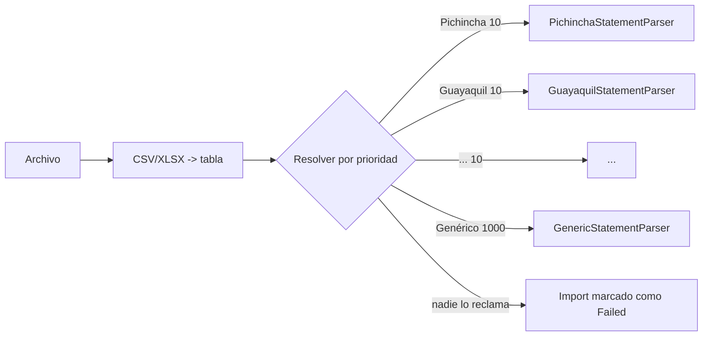

# Agregar un proveedor

Un "proveedor" es un banco o una billetera. El objetivo del diseño es que
agregar uno sea aburrido.

## 1. Registrarlo en el catálogo

En `ReferenceDataSeeder.SeedProvidersAsync`:

```csharp
Provider.Create(
    "BANECUADOR", "BanEcuador", "BanEcuador", ProviderKind.Bank,
    [ConnectionMode.ManualImport],      // solo lo que exista de verdad
    now, "BANECUADOR_V1", "#0B6E4F", "banecuador", 8),
```

**`SupportedModes` es un compromiso, no una aspiración.** La app muestra
exactamente lo que hay aquí, y abrir una cuenta en un modo no soportado lanza
`unsupported_connection_mode`.

## 1.b Lo que un export real puede tener de raro

Merece la pena mirar un archivo real antes de escribir sinónimos. El export XLSX
de la banca web de Pichincha, por ejemplo:

* **No nombra al banco en ninguna parte.** Su encabezado dice solo "Movimientos
  de Cuenta". Por eso existe `HeaderSignatures`: la combinación de columnas
  identifica el formato cuando el membrete no lo hace.
* **El encabezado está en la fila 6**, con filas vacías y un descargo legal
  encima.
* **Cada movimiento ocupa dos filas físicas**: la primera lleva fecha, concepto,
  tipo, monto y saldo; la segunda, el Nro. de Documento. La clase base fusiona la
  segunda en la primera.
* **La celda del encabezado y la del valor no están en la misma columna** (celdas
  combinadas): el Nro. de Documento se rotula en la columna 8 y se escribe en la
  7. Por eso la fusión busca por forma —una celda de solo dígitos— y no por
  índice de columna.
* **La fecha trae hora en formato de 12 horas**: `2026-8-31, 12:51 PM`.
* **La dirección viene escrita** en una columna `Tipo` (Débito/Crédito), que es
  más fiable que deducirla del signo.
* **Los movimientos van del más nuevo al más viejo**, así que el saldo de cierre
  es el de la *primera* fila.
* **Una transferencia interbancaria genera tres movimientos** —la transferencia,
  la comisión y el IVA de esa comisión— **con un mismo Nro. de Documento**. Ver
  `docs/transaction-deduplication.md`: por esto el importe forma parte del
  fingerprint incluso cuando hay referencia.

## 2. Parser de estado de cuenta

Casi siempre basta con declarar los sinónimos de las columnas:

```csharp
public sealed class BanEcuadorStatementParser : HeaderMappedStatementParser
{
    public override string ParserCode => "BANECUADOR_V1";
    public override string? ProviderCode => "BANECUADOR";
    public override int Priority => 10;   // antes que el genérico (1000)

    protected override IReadOnlyList<string> FileSignatures => ["BANECUADOR"];
    protected override IReadOnlyList<string> DateHeaders => ["FECHA", "FECHA PROCESO"];
    protected override IReadOnlyList<string> DescriptionHeaders => ["DETALLE", "CONCEPTO"];
    protected override IReadOnlyList<string> DebitHeaders => ["DEBITO", "CARGO"];
    protected override IReadOnlyList<string> CreditHeaders => ["CREDITO", "ABONO"];
}
```

La clase base se encarga de encontrar la fila de encabezados, mapear columnas,
leer montos en cualquier formato, interpretar fechas en la zona del usuario,
extraer la máscara de cuenta y reportar filas inválidas sin abortar el archivo.

Si el banco invierte el signo de la columna de débito, sobreescribe
`ExpensesArePositiveInDebitColumn`. Si el formato es tan distinto que no encaja,
implementa `IStatementParser` directamente: el resolver solo pide `CanParse` y
`ParseAsync`.

Regístralo en `DependencyInjection.AddStatementParsers`.

## 3. Parser de correo (opcional)

```csharp
public sealed class BanEcuadorEmailParser : SpanishNotificationEmailParser
{
    public override string ProviderCode => "BANECUADOR";
    public override string ParserCode => "BANECUADOR_EMAIL_V1";
    protected override IReadOnlyList<string> Signatures => ["BANECUADOR"];
}
```

Y el dominio de remitente en `SeedTrustedSendersAsync`. Registra el parser en
`AddBankEmailParsers`.

## 4. Tests

Añade una fixture ficticia en `samples/` y un caso en `StatementParserTests`:
que el resolver elija tu parser, que las direcciones salgan bien y que una fila
inválida no tumbe el archivo.

## 5. Lo que **no** hay que hacer

* No tocar `Transaction`, `ImportService` ni el pipeline de correo. Si un
  proveedor nuevo te obliga a modificarlos, el contrato está mal y hay que
  arreglar el contrato.
* No hacer scraping de banca web.
* No pedir ni almacenar credenciales bancarias.
* No inventar endpoints de una institución. Si no existe API pública o acuerdo,
  el proveedor se queda en `ManualImport`.

## Resolución de parsers



El parser genérico acepta cualquier archivo con columnas reconocibles de fecha,
descripción y valor. Es lo que permite que un usuario con un banco no soportado
igual pueda importar hoy.
