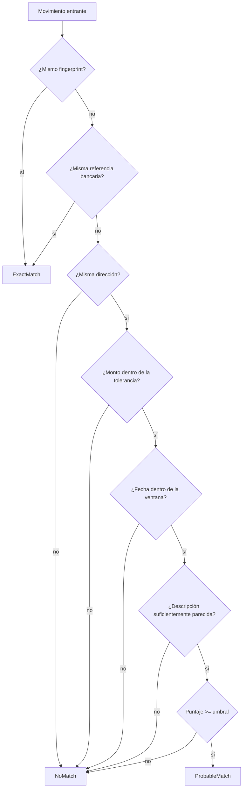

# Deduplicación

El mismo movimiento puede llegar dos veces: primero como notificación por correo
y después como fila de un estado de cuenta. **No puede aparecer dos veces en la
app**, y tampoco puede desaparecer un movimiento real por parecerse a otro.

## Fingerprint

Identidad determinista de un movimiento, calculada igual para todos los canales:

```
Con referencia utilizable:
  sha256("v3|REF|{provider}|{accountId}|{referencia}|{direction}|{monto}")

Sin referencia:
  sha256("v3|HEU|{provider}|{accountId}|{yyyyMMdd del día calendario del titular}|{direction}|{monto}|{descripción normalizada}")
```

> **Por qué el importe está también en el modo referencia.** La primera versión
> usaba solo la referencia. Al probarla contra un estado de cuenta real de Banco
> Pichincha apareció que una transferencia interbancaria genera **tres**
> movimientos con el mismo `Nro. Documento`: la transferencia, la comisión y el
> IVA de esa comisión. Con la receta antigua, 54 movimientos colapsaban a 34
> fingerprints: se habrían perdido 20 movimientos reales sin que nadie lo notara.
> Con el importe y la dirección dentro de la clave, los 54 son distintos y no hay
> ninguna colisión. La fecha sigue fuera, que es lo que permite que la
> notificación por correo y la fila del estado de cuenta se encuentren.

Decisiones deliberadas:

* **Día calendario, no timestamp.** El correo llega a las 18:12 y el estado de
  cuenta contabiliza a las 03:00 del día siguiente. Comparar timestamps no
  encontraría nada.
* **Día calendario del titular, no el de UTC (Entregable 27).** Una compra a
  las 23:12 en Ecuador (UTC-5) son las 04:12 UTC del día siguiente. Comparar
  `DateTimeOffset.UtcDateTime.Date` directamente podía poner el correo y el
  estado de cuenta de un mismo movimiento en dos días distintos, o estirar
  artificialmente la ventana de fechas justo lo suficiente para que un
  duplicado real pasara como `NoMatch` sin que nadie lo notara.
  `TransactionFingerprint.EcuadorCalendarDay` y el cálculo de brecha de días en
  `DeduplicationMatcher` usan un offset fijo UTC-5 (Ecuador no tiene horario de
  verano, así que es exacto, no una aproximación) en vez de la fecha UTC cruda.
  No se conecta con el `TimeZoneId` real de cada usuario (que sí existe en
  `User`): son tipos puros del dominio sin esa dependencia, y mientras el
  producto sea solo para Ecuador la diferencia siempre es exactamente UTC-5.
* **Descripción normalizada.** "Compra en SUPERMAXI ALBORADA con tu tarjeta
  terminada en 4821" y "SUPERMAXI ALBORADA GYE" se reducen a tokens comparables.
* **Referencia solo si sirve.** Los bancos emiten `0`, `-` o columnas vacías;
  `HasUsableReference` las descarta.
* **Versión en el prefijo.** Permite cambiar la receta sin que los
  fingerprints guardados dejen de ser interpretables. `v3` (Entregable 27) es
  el cambio de día UTC a día local descrito arriba.

## Normalización de texto

`TextNormalizer` quita acentos y puntuación, pasa a mayúsculas, elimina números
sueltos y descarta ruido bancario (`COMPRA`, `PAGO`, `TARJETA`, `REF`, `EN`,
`CON`…). La similitud es Jaccard por tokens: las descripciones bancarias difieren
en palabras completas (ciudad, sucursal, canal), no en letras, así que comparar
tokens funciona mejor que la distancia de edición.

## Las tres respuestas



**Puntaje** = `0.40 × monto + 0.25 × fecha + 0.35 × descripción`.

| Parámetro | Valor por defecto | Configurable en |
| --- | --- | --- |
| Ventana de fechas | ±3 días | `Nexo:Deduplication:DateWindowDays` |
| Tolerancia de monto | 2% | `Nexo:Deduplication:AmountTolerance` |
| Umbral de probable | 0.72 | `Nexo:Deduplication:ProbableThreshold` |
| Similitud mínima | 0.30 | `Nexo:Deduplication:MinimumDescriptionSimilarity` |

## Qué se hace con cada resultado

| Resultado | En una importación | En el pipeline de correo |
| --- | --- | --- |
| `ExactMatch` | Se **actualiza** el movimiento ya existente con el dato autoritativo del estado de cuenta (ver "De ExactMatch a movimiento actualizado" abajo); no se crea una fila nueva | Se descarta el movimiento |
| `ProbableMatch` | Se **importa** con `Status = NeedsReview` y enlace al candidato | Igual |
| `NoMatch` | Se importa normal | Se crea como `Pending` |

**Una coincidencia dudosa nunca elimina información.** El movimiento se guarda,
se muestra marcado ("Posible duplicado") y el usuario decide. Es la única
política defendible: perder un movimiento real es peor que mostrar uno de más
durante un rato.

## De ExactMatch a movimiento actualizado (Entregable 27)

El caso típico: una notificación por correo crea un movimiento
`Source = Email`, `Status = Pending`, `SourceConfidence = Medium`. Días
después llega el estado de cuenta y trae la misma referencia bancaria (o el
mismo fingerprint). Antes de este entregable, `ImportService.ConfirmAsync`
simplemente **saltaba** esa fila -- `Transaction.UpgradeFrom` existía en el
dominio, tenía su propio test unitario, pero no tenía ningún llamador en toda
la aplicación. El resultado: el movimiento detectado por correo se quedaba en
`Pending`/`Medium` para siempre, sin el monto exacto, la referencia o la
descripción final del banco.

Ahora, cuando una fila del import es `ExactDuplicate`, `ConfirmAsync` carga el
movimiento existente (`ImportRow.MatchedTransactionId`) y le aplica
`UpgradeFrom` con los datos del estado de cuenta: monto exacto, fecha,
descripción, y `SourceConfidence = High`, `Status = Posted`. Una excepción
deliberada: si ese movimiento ya está `Ignored` (el usuario ya lo descartó
mediante la revisión de duplicados, ver abajo), no se toca -- resucitar una
decisión que la persona ya tomó sería peor que dejar pasar la actualización.

`ImportResultDto.UpgradedCount` reporta cuántas filas de un import tomaron
esta ruta, por separado de `ImportedCount` (filas realmente nuevas) y
`FlaggedForReview` (probables duplicados).

## Cerrando el círculo de revisión (Entregable 27)

`Transaction.ConfirmNotDuplicate()` y `Transaction.Ignore()` existían en el
dominio desde antes, pero no tenían ningún llamador: un movimiento marcado
`NeedsReview` se mostraba en la app ("lo guardamos aparte para que decidas
tú") y ahí se quedaba, para siempre, sin ninguna manera de resolver la
revisión. `PUT /api/v1/transactions/{id}/duplicate-review` con
`{ "keepAsSeparate": true|false }` cierra ese círculo: `true` confirma que es
un movimiento propio (vuelve a `Posted`), `false` confirma que es el mismo
que ya tenía (`Ignored` -- nunca se borra). Solo aplica a movimientos que
estén efectivamente `NeedsReview`; sobre cualquier otro estado responde 409.
Como `NeedsReview`/`Ignored` no cuentan para el saldo pero `Posted` sí, la
resolución siempre recalcula el saldo de la cuenta y los insights.

## Dos decisiones que parecen detalles y no lo son

**Las filas de un mismo archivo no se comparan entre sí.** Un estado de cuenta
lista cada movimiento exactamente una vez, así que dos filas idénticas son dos
cafés iguales el mismo día, no un duplicado. Los repetidos reales son
*entre* fuentes, y para eso está la ventana de movimientos ya almacenados.

**Un movimiento almacenado solo absorbe un entrante.** Al encontrar un
`ExactMatch`, el candidato sale del pool. Si el usuario ya tenía uno de esos dos
cafés (por el correo) y el estado de cuenta trae los dos, el segundo entra.

## Índice y unicidad

Existe un índice sobre `(FinancialAccountId, Fingerprint)`, pero **no es único**:
dos compras genuinamente idénticas el mismo día comparten fingerprint. Quien
decide qué significa eso es el matcher, con su contexto, no una restricción de la
base de datos.

## Tests

`DeduplicationMatcherTests` cubre los casos críticos del requerimiento:
mismo movimiento dos veces, correo + Excel del mismo movimiento, montos
positivos y negativos, movimientos sin referencia, cuentas distintas, comercios
distintos, movimientos ignorados, cambio de umbral y elección del mejor candidato,
más (Entregable 27) el caso de frontera de día UTC descrito arriba.
`TransactionFingerprintTests` cubre la receta del fingerprint en sí, incluido
ese mismo caso de frontera. `CrossSourceDeduplicationTests` prueba de punta a
punta tanto el camino `ProbableMatch` (movimiento de correo + estado de cuenta
sin referencia compartida) como el `ExactMatch` con actualización
(`UpgradeFrom`, misma referencia bancaria). `DuplicateReviewTests` cubre el
endpoint de resolución: mantener como propio, ignorar, intentar resolver algo
que no está en revisión, e intentar resolver el de otro usuario.

## Pendientes conocidos (Entregable 27)

No corregidos a propósito, por ser decisiones de negocio o cambios de mayor
riesgo sin manera de compilar/probar en este entorno:

* **`AmountTolerance` (2%) es angosta para el uso real en Ecuador.** Su propio
  comentario dice "para propinas y redondeo de moneda", pero el servicio es
  obligatorio del 10% más propina voluntaria -- una autorización con el monto
  base y la liquidación final con propina fácilmente superan el 2%. Subir el
  valor es una decisión de producto (¿qué tan agresivo debe ser el emparejamiento?)
  que le corresponde definir a Anderson, no a mí.
* **Un `ProbableMatch` no reserva su candidato dentro del mismo lote.** Solo
  un `ExactMatch` saca al candidato del pool (`DeduplicationService`); dos
  filas del mismo archivo podrían marcarse ambas como probable duplicado del
  mismo movimiento existente. No se ha visto en un test que lo reproduzca; es
  una hipótesis de código, de bajo riesgo (nunca se pierde información, solo
  podría generar dos revisiones en vez de una).
* **Los totales de la vista previa de importación incluyen los montos de
  `ProbableMatch`.** Solo `ExactMatch` se excluye del `income`/`expense`
  mostrado antes de confirmar (`ImportService.UploadAsync`), aunque un
  `ProbableMatch` confirmado termina en `NeedsReview` y no cuenta para el
  saldo real. El saldo final (recalculado tras confirmar) siempre es correcto;
  solo el número mostrado en la vista previa puede sobrestimar por un rato.
* **`Transaction.UpgradeFrom` no toca `Currency` ni `Direction`.** Hoy es
  inofensivo porque Ecuador es solo USD y el matcher ya exige la misma
  `Direction` antes de considerar cualquier coincidencia -- pero si Nexo algún
  día soporta más de una moneda, esto necesita revisión explícita antes de
  confiar en `UpgradeFrom` para esos casos.
