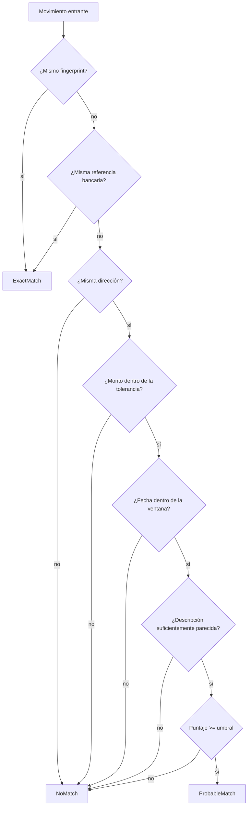

# Deduplicación

El mismo movimiento puede llegar dos veces: primero como notificación por correo
y después como fila de un estado de cuenta. **No puede aparecer dos veces en la
app**, y tampoco puede desaparecer un movimiento real por parecerse a otro.

## Fingerprint

Identidad determinista de un movimiento, calculada igual para todos los canales:

```
Con referencia utilizable:
  sha256("v1|REF|{provider}|{accountId}|{referencia}")

Sin referencia:
  sha256("v1|HEU|{provider}|{accountId}|{yyyyMMdd}|{direction}|{monto}|{descripción normalizada}")
```

Decisiones deliberadas:

* **Día calendario, no timestamp.** El correo llega a las 18:12 y el estado de
  cuenta contabiliza a las 03:00 del día siguiente. Comparar timestamps no
  encontraría nada.
* **Descripción normalizada.** "Compra en SUPERMAXI ALBORADA con tu tarjeta
  terminada en 4821" y "SUPERMAXI ALBORADA GYE" se reducen a tokens comparables.
* **Referencia solo si sirve.** Los bancos emiten `0`, `-` o columnas vacías;
  `HasUsableReference` las descarta.
* **Versión en el prefijo.** `v1` permite cambiar la receta sin que los
  fingerprints guardados dejen de ser interpretables.

## Normalización de texto

`TextNormalizer` quita acentos y puntuación, pasa a mayúsculas, elimina números
sueltos y descarta ruido bancario (`COMPRA`, `PAGO`, `TARJETA`, `REF`, `EN`,
`CON`…). La similitud es Jaccard por tokens: las descripciones bancarias difieren
en palabras completas (ciudad, sucursal, canal), no en letras, así que comparar
tokens funciona mejor que la distancia de edición.

## Las tres respuestas



**Puntaje** = `0.40 × monto + 0.25 × fecha + 0.35 × descripción`.

| Parámetro | Valor por defecto | Configurable en |
| --- | --- | --- |
| Ventana de fechas | ±3 días | `Nexo:Deduplication:DateWindowDays` |
| Tolerancia de monto | 2% | `Nexo:Deduplication:AmountTolerance` |
| Umbral de probable | 0.72 | `Nexo:Deduplication:ProbableThreshold` |
| Similitud mínima | 0.30 | `Nexo:Deduplication:MinimumDescriptionSimilarity` |

## Qué se hace con cada resultado

| Resultado | En una importación | En el pipeline de correo |
| --- | --- | --- |
| `ExactMatch` | La fila se marca como duplicada y **no** se escribe | Se descarta el movimiento |
| `ProbableMatch` | Se **importa** con `Status = NeedsReview` y enlace al candidato | Igual |
| `NoMatch` | Se importa normal | Se crea como `Pending` |

**Una coincidencia dudosa nunca elimina información.** El movimiento se guarda,
se muestra marcado ("Posible duplicado") y el usuario decide. Es la única
política defendible: perder un movimiento real es peor que mostrar uno de más
durante un rato.

## Dos decisiones que parecen detalles y no lo son

**Las filas de un mismo archivo no se comparan entre sí.** Un estado de cuenta
lista cada movimiento exactamente una vez, así que dos filas idénticas son dos
cafés iguales el mismo día, no un duplicado. Los repetidos reales son
*entre* fuentes, y para eso está la ventana de movimientos ya almacenados.

**Un movimiento almacenado solo absorbe un entrante.** Al encontrar un
`ExactMatch`, el candidato sale del pool. Si el usuario ya tenía uno de esos dos
cafés (por el correo) y el estado de cuenta trae los dos, el segundo entra.

## Índice y unicidad

Existe un índice sobre `(FinancialAccountId, Fingerprint)`, pero **no es único**:
dos compras genuinamente idénticas el mismo día comparten fingerprint. Quien
decide qué significa eso es el matcher, con su contexto, no una restricción de la
base de datos.

## Tests

`DeduplicationMatcherTests` cubre los casos críticos del requerimiento:
mismo movimiento dos veces, correo + Excel del mismo movimiento, montos
positivos y negativos, movimientos sin referencia, cuentas distintas, comercios
distintos, movimientos ignorados, cambio de umbral y elección del mejor candidato.
